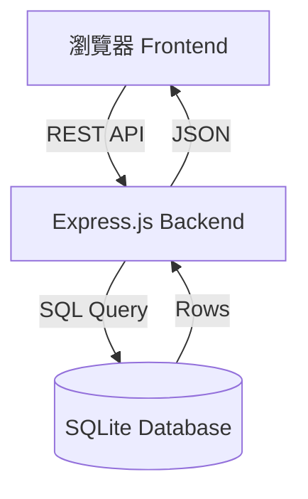

# 🍱 台灣便當物價觀測站 - 系統詳細設計文件 (OpenSpec)

## 1. 專案概觀
- **專案名稱**: 台灣便當物價觀測站 (Bento Price Watch)
- **開發目標**: 透過歷史數據追蹤台灣便當物價趨勢，提供視覺化分析工具，探討十年通膨影響。
- **核心功能**:
  - 資料庫自動化初始化 (Seeding 50 records)
  - 即時趨勢圖表 (Line Chart Analysis)
  - 分類與關鍵字搜尋系統 (Filtering System)
  - 物價資料社群貢獻 (Data Contribution)

## 2. 系統架構圖 (Architecture)


## 3. 資料庫詳細設計 (Database Specification)
資料庫存放路徑：`myexpress/sqlite.db`

### 3.1 `prices` 表格結構
| 欄位 | 類型 | 約束 | 內容說明 |
| :--- | :--- | :--- | :--- |
| **id** | INTEGER | PRIMARY KEY, AUTOINC | 唯一標識序號 |
| **date** | TEXT | NOT NULL | 格式: YYYY-MM-DD |
| **provider** | TEXT | DEFAULT '一般用戶' | 來源單位或提供者 (新功能) |
| **name** | TEXT | NOT NULL | 餐點名稱 (關鍵字比對欄位) |
| **price** | INTEGER | NOT NULL | 台幣價格 (單位: TWD) |
| **source** | TEXT | - | 原始數據參考網址 |

## 4. API 介面定義 (RESTful API)

### 4.1 核心查詢介面
- **方法**: `GET /api/quotes`
- **功能**: 檢索便當價格清單。
- **查詢參數 (Query Params)**:
  - `keyword`: (選填) 搜尋字串。匹配邏輯：`WHERE name LIKE %keyword% OR provider LIKE %keyword%`。
- **響應範例**: `[{ "id": 1, "date": "2013-05-13", "name": "排骨便當", "price": 80, ... }]`

### 4.2 資料提交介面
- **方法**: `POST /api/insert`
- **Payload (JSON)**:
  ```json
  {
    "provider": "用戶名稱",
    "name": "便當名稱",
    "price": 120,
    "date": "2024-05-13",
    "source": "http://..."
  }
  ```

## 5. 前端實作邏輯 (Logic Design)

### 5.1 數據渲染流程 (Rendering Workflow)
1. **呼叫 API**: 執行 `fetchAllData(keyword)`。
2. **防錯機制**: 檢查 `Array.isArray(data)` 防止非陣列回傳造成排序崩潰。
3. **資料排序**: 以 `date` 欄位進行由舊到新的排序。
4. **介面更新**: 清空 `tbody` 並使用 `prepend` 讓最新資料顯示在最上方。
5. **圖表更新**: 使用過濾後的資料重繪 Chart.js。

### 5.2 狀態處理
- **加載中**: 表格內容暫時清空。
- **查無資料**: 若 API 回傳空陣列，表格顯示「🔍 找不到符合的物價紀錄」。

## 6. 環境配置與執行
- **啟動指令**: `npm start` (指向 `myexpress/bin/www`)
- **初始化指令**: `node myexpress/db.js` (會清空並重建 50 筆初始資料)
- **外部依賴**:
  - `sqlite3`: 資料庫驅動。
  - `Chart.js`: 前端圖表框架。
  - `Tailwind CSS`: UI 樣式系統。

---
*版本: v1.3.1 | 更新時間: 2026-05-13*
*由 GitHub Copilot 自動生成與維護*